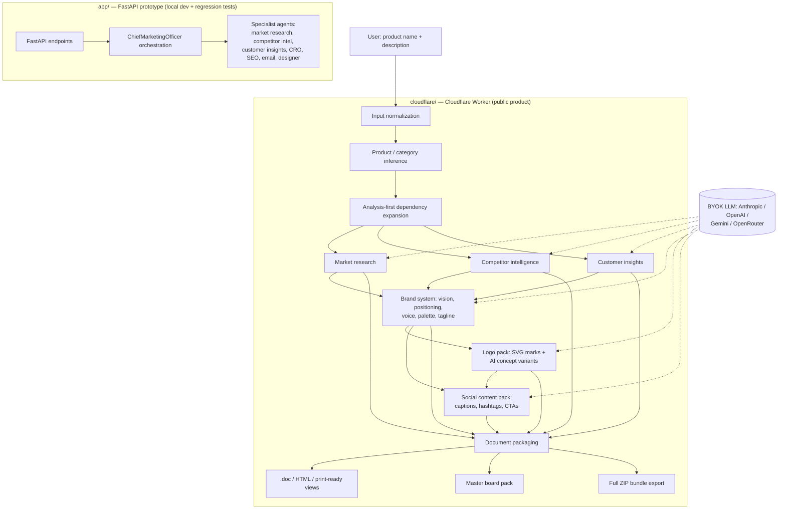

# Marketing OS

CEO-grade, Cloudflare-hosted marketing operating system that turns a lightweight product brief into a research-first, board-ready strategy pack — market research, competitor intelligence, customer insights, brand system, logo pack, social creatives, and downloadable reports.

**Live demo:** https://arjun-marketing-os.srksourabh.workers.dev
**GitHub repo:** https://github.com/srksourabh/marketing-os

## Overview

Most AI marketing demos land at one of two bad extremes: raw LLM text dumps with no packaging, or pretty creative output with shallow strategy underneath. Marketing OS exists to close that gap.

Give it a product name and a short description, and it:

1. infers what the product actually is and what category it competes in
2. forces research (market, competitors, customers) to run *before* any creative work
3. builds a brand system and creative assets grounded in that research
4. packages everything as presentable, executive-style deliverables — not JSON dumps
5. lets you download the result as `.doc`, HTML, PDF-ready print views, or a bundled ZIP

The repo contains two application tracks:

- **`cloudflare/`** — the primary public product, a Cloudflare Worker that serves the live demo
- **`app/`** — an earlier FastAPI implementation kept as a local Python test harness / reference

## Key features

- **Analysis-first enforcement** — brand, logo, and social deliverables automatically pull in market research, competitor intel, and customer insights as prerequisites, so creative work is never generated ungrounded
- **Category-sensitive logic** — fashion/e-commerce briefs follow different strategy and creative paths than SaaS briefs
- **Bring-your-own-key LLM support** — works with Anthropic, OpenAI, Gemini, or OpenRouter keys, auto-detected from the key prefix, with separate "reasoning" and "fast" model tiers
- **Streaming generation** — the Worker's `/run` endpoint streams progress over Server-Sent Events as each node in the 23-node deliverable DAG completes
- **23 selectable deliverables** — from a one-line product summary up to a full CEO growth brief, brand identity suite, logo pack, and master board pack
- **Downloadable, executive-formatted output** — Word-friendly `.doc`, HTML, print-ready views, and a full ZIP bundle export
- **AI + deterministic creative assets** — SVG logo/icon marks generated deterministically (so wording is always exact) alongside AI-generated logo concept and social image variants

## Tech stack

| Layer | Technology |
|---|---|
| Primary product (public demo) | Cloudflare Workers, vanilla JS (ES modules), Cloudflare Workers Static Assets |
| LLM providers (BYOK) | Anthropic Claude, OpenAI, Google Gemini, OpenRouter — called directly via `fetch`, no SDK |
| Image generation | Gemini / OpenAI image APIs |
| Prototype backend | Python 3.13, FastAPI, Uvicorn |
| Prototype dependency management | `uv` (with `pyproject.toml` / `uv.lock`), plus `requirements.txt` for Render |
| Testing | `pytest` (Python test harness in `tests/`) |
| Alternate deployment path | Render (`render.yaml`, runs the FastAPI app) |

## Architecture



More detail: [docs/ARCHITECTURE.md](docs/ARCHITECTURE.md)

## Repository layout

```text
marketing-os/
├── app/                    # FastAPI prototype and orchestration modules
│   ├── agents/             # specialist marketing agents (SEO, CRO, email, designer, etc.)
│   ├── orchestration/       # chief marketing officer flow
│   ├── services/            # product inference / shared services
│   └── static/               # prototype web UI
├── cloudflare/             # primary Worker-based public product
│   ├── public/              # Worker frontend (static assets)
│   ├── src/                 # Worker backend: orchestrator, LLM client, asset generation
│   └── wrangler.toml         # deployment config
├── docs/
│   ├── ARCHITECTURE.md      # deeper architecture notes
│   └── screenshots/         # README screenshots
├── scripts/                # support scripts, e.g. screenshot capture
├── tests/                  # Python API and orchestration test coverage
├── pyproject.toml          # Python project metadata (uv)
├── requirements.txt        # Render / simple pip install path
└── render.yaml             # optional FastAPI deployment blueprint (Render)
```

## Setup & installation

### Prerequisites

- Python 3.13+
- [`uv`](https://docs.astral.sh/uv/) for the Python side
- Node.js (for `npx wrangler` and the optional screenshot script)
- A Cloudflare account (only needed if you want to deploy the Worker yourself)

### Clone the repo

```bash
git clone https://github.com/srksourabh/marketing-os.git
cd marketing-os
```

### Install Python dependencies (FastAPI prototype)

```bash
uv sync --active --all-extras
```

### Run the FastAPI app locally

```bash
uv run --active uvicorn app.main:app --host 127.0.0.1 --port 8008
```

Then open `http://127.0.0.1:8008` in a browser.

### Run the Python test suite

```bash
uv run --active pytest -q
```

### Run the Cloudflare Worker locally

```bash
cd cloudflare
npx wrangler dev
```

### Deploy the Worker to Cloudflare

```bash
cd cloudflare
npx wrangler deploy
```

The Worker's optional live image generation needs a Gemini key set as a secret:

```bash
npx wrangler secret put GEMINI_API_KEY
```

(BYOK requests from the browser can also supply their own Anthropic/OpenAI/Gemini/OpenRouter key at request time, so this secret is only needed if you want server-side image generation without asking every visitor for a key.)

### Deploy the FastAPI app to Render (alternate path)

Render picks up `render.yaml` automatically and runs:

```bash
pip install -r requirements.txt
uvicorn app.main:app --host 0.0.0.0 --port $PORT
```

## Usage

1. Open the live demo (or your local deployment) in a browser.
2. Enter a product name and a short description of what it does.
3. Select which deliverables you want (market research, brand identity suite, logo pack, social content, master board pack, full ZIP export, etc.). Selecting a downstream deliverable (e.g. logo pack) automatically pulls in its research prerequisites.
4. If using the live BYOK `/run` flow, paste an Anthropic, OpenAI, Gemini, or OpenRouter API key — the provider and default models are inferred from the key itself.
5. Watch generation stream in as each stage (research → brand → creative → packaging) completes.
6. Download individual deliverables (`.doc`, HTML, print-ready PDF view) or the full ZIP bundle.

## Screenshots

### Homepage / workflow


### Generated deliverable card


## Quality guardrails built into the product

- **Analysis-first enforcement** — brand, logo, and social outputs auto-require earlier research steps
- **Category-sensitive logic** — fashion/e-commerce briefs follow different strategy and creative paths than SaaS briefs
- **Executive formatting** — outputs are packaged as deliverables, not debug payloads
- **Downloadable artifacts** — the system returns assets a CEO can review, forward, and archive

## Known design choices

- The Cloudflare Worker is the main product surface; the FastAPI app is retained as a simpler Python testbed for orchestration ideas and regression tests
- AI-generated PNG logos are treated as **concept marks**, while deterministic SVG text assets remain the safer path for exact wording
- Exported `.doc` files are HTML-compatible Word documents for speed and portability

## Next useful improvements

- Move research generation from deterministic heuristics toward stronger retrieval-backed market/competitor inputs
- Add a proper provider abstraction for OpenAI Images / Nano Banana / Gemini switching
- Add persistent artifact storage rather than response-embedded binaries
- Add CI deploy previews for the Worker
- Split Worker logic into smaller modules for easier maintenance

## License

No license file has been added yet. Treat this repository as private/internal until a license is chosen.
