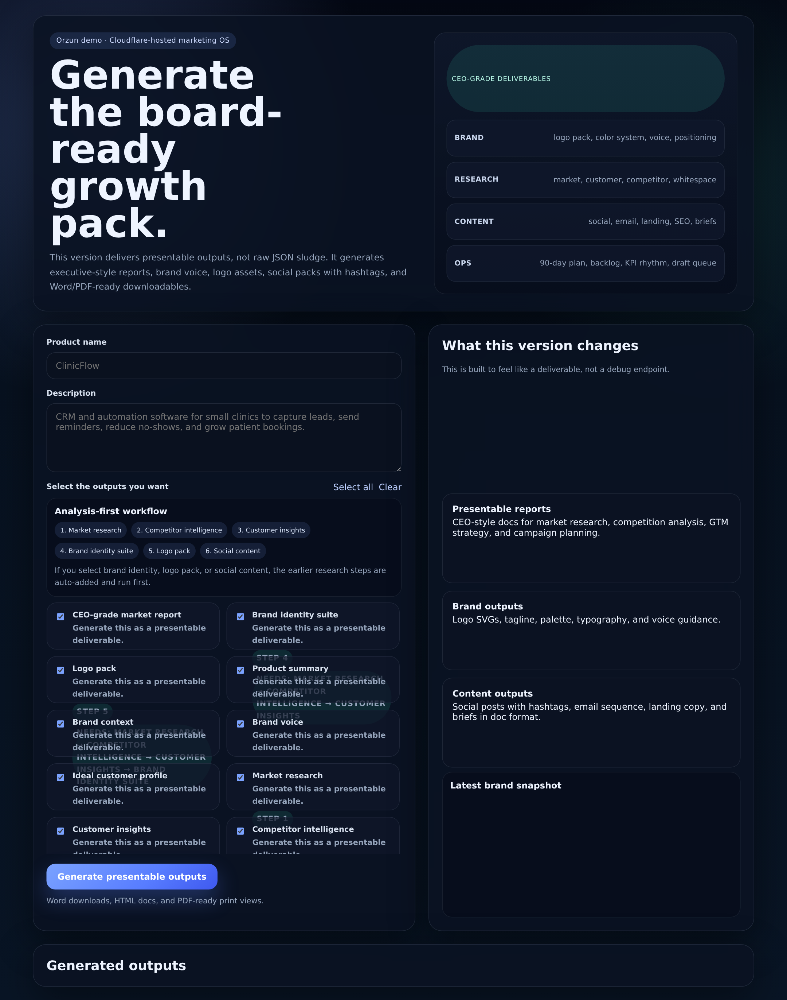
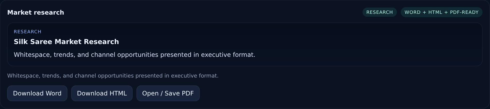

# Marketing OS

CEO-grade, Cloudflare-hosted marketing operating system that turns a lightweight product brief into a board-ready strategy pack: market research, competitor intelligence, customer insights, brand system, logo pack, social creatives, downloadable reports, and ZIP exports.

**Live demo:** https://arjun-marketing-os.srksourabh.workers.dev  
**GitHub repo:** https://github.com/srksourabh/marketing-os

## Overview

Marketing OS is built for a draft-first workflow:

- start with a product name and short description
- force research before creative work
- generate presentable, executive-style artifacts instead of raw JSON
- export deliverables as Word-friendly `.doc`, HTML, PDF-ready print views, and bundled ZIP packages
- create visual assets with AI while keeping brand logic grounded in product/category analysis

This repo currently contains two application tracks:

1. **`cloudflare/`** — the primary public product, deployed on Cloudflare Workers
2. **`app/`** — the earlier FastAPI implementation and test harness used for prototyping and API validation

## Live product

The production demo is live here:

**https://arjun-marketing-os.srksourabh.workers.dev**

### What the live demo produces

| Area | Deliverables |
|---|---|
| Research | Market research, competitor intelligence, customer insights |
| Brand | Brand identity suite, positioning, vision, palette, voice |
| Creative | Logo pack, icon mark, social content, image prompts, generated visual variants |
| Executive packaging | Master board pack, Word-friendly docs, HTML docs, PDF-ready print views |
| Ops | Content backlog, execution backlog, campaign plan, cron-ready operating rhythm |
| Bundling | Full ZIP export with curated artifacts |

### Quality guardrails built into the product

- **Analysis-first enforcement** — brand, logo, and social outputs auto-require earlier research steps
- **Category-sensitive logic** — fashion/ecommerce briefs now follow different strategy and creative paths than SaaS briefs
- **Executive formatting** — outputs are packaged as deliverables, not debug payloads
- **Downloadable artifacts** — the system returns assets a CEO can review, forward, and archive

## Screenshots

### Homepage / workflow



### Generated deliverable card



## Why this exists

Most AI marketing demos stop at one of two bad extremes:

- raw LLM text dumps with no packaging
- pretty creative output with shallow strategy underneath

Marketing OS is designed to close that gap by combining:

- structured product inference
- research-first strategy generation
- presentable board-ready formatting
- downloadable artifact generation
- public demo hosting on Cloudflare

## Core product capabilities

### 1. Research and strategy

- Market analysis with whitespace, demand drivers, risk signals, and positioning moves
- Competitor intelligence with battlecards, blind spots, disruptable assumptions, and perceptual framing
- Customer insight generation covering jobs-to-be-done, objections, motivations, proof needed, and decision criteria

### 2. Brand system

- Brand vision and positioning
- Tagline, voice, reasons-to-believe, archetype, palette, typography direction
- Category-aware messaging logic

### 3. Creative outputs

- SVG logo and icon assets
- AI-generated logo concept and variant prompts
- Social content pack with captions, hashtags, CTA framing, and visual direction
- Multi-variant image generation flow for logos and social creative

### 4. Executive deliverables

- CEO-grade market report
- Competitor intelligence pack
- Customer insights pack
- Brand identity suite
- Master board pack
- Full ZIP bundle export

## Architecture

```text
User brief
   ↓
Product/category inference
   ↓
Research layer
   ├─ market research
   ├─ competitor intelligence
   └─ customer insights
   ↓
Brand system
   ↓
Asset generation
   ├─ logo pack
   ├─ social creative
   └─ downloadable docs
   ↓
Packaging layer
   ├─ master board pack
   ├─ print-ready views
   └─ ZIP bundle
```

More detail: [docs/ARCHITECTURE.md](docs/ARCHITECTURE.md)

## Repository layout

```text
marketing-os/
├── app/                    # FastAPI prototype and orchestration modules
│   ├── agents/             # specialist marketing agents
│   ├── orchestration/      # chief marketing officer flow
│   ├── services/           # product inference / shared services
│   └── static/             # prototype web UI
├── cloudflare/             # primary Worker-based public product
│   ├── public/             # Worker frontend
│   ├── src/                # Worker backend / artifact generator
│   └── wrangler.toml       # deployment config
├── docs/
│   └── screenshots/        # README assets
├── scripts/                # support scripts, e.g. screenshot capture
├── tests/                  # API and orchestration coverage
├── pyproject.toml          # Python project metadata
├── requirements.txt        # Render / simple Python install path
└── render.yaml             # optional FastAPI deployment blueprint
```

## Local development

### Prerequisites

- Python 3.13+
- `uv`
- Node.js 22+ if you want to run the screenshot tooling

### Install Python dependencies

```bash
cd /path/to/marketing-os
uv sync --active --all-extras
```

### Run the FastAPI app locally

```bash
uv run --active uvicorn app.main:app --host 127.0.0.1 --port 8008
```

### Run tests

```bash
uv run --active pytest -q
```

## Cloudflare Worker deployment

The primary live product is the Worker app in `cloudflare/`.

### Deploy

```bash
cd cloudflare
npx wrangler deploy
```

### Required secret for live image generation

```bash
npx wrangler secret put GEMINI_API_KEY
```

## FastAPI / Render deployment

The FastAPI app remains useful for local API development and regression testing.

Deploy path:

```bash
# Render uses this command from render.yaml
uvicorn app.main:app --host 0.0.0.0 --port $PORT
```

## Verification status

Recently verified in this repo/workspace:

- Cloudflare Worker deployed and reachable publicly
- ZIP bundle export working
- master board pack working
- multi-variant logo and social asset generation working
- analysis-first dependency enforcement working
- silk saree / fashion inference corrected so the system no longer falls back to SaaS-style brand output
- Python test suite passing locally (`15 passed`)

## Known design choices

- The Worker is the main product surface
- The FastAPI app is still retained because it gives a simpler Python testbed
- AI-generated PNG logos are treated as **concept marks**, while deterministic SVG text assets remain the safer path for exact wording
- Exported `.doc` files are HTML-compatible Word documents for speed and portability

## Next useful improvements

- move research generation from deterministic heuristics toward stronger retrieval-backed market/competitor inputs
- add a proper provider abstraction for OpenAI Images / Nano Banana / Gemini switching
- add persistent artifact storage rather than response-embedded binaries
- add CI deploy previews for the Worker
- split Worker logic into smaller modules for easier maintenance

## License

No license file has been added yet. Treat this repository as private/internal until a license is chosen.
